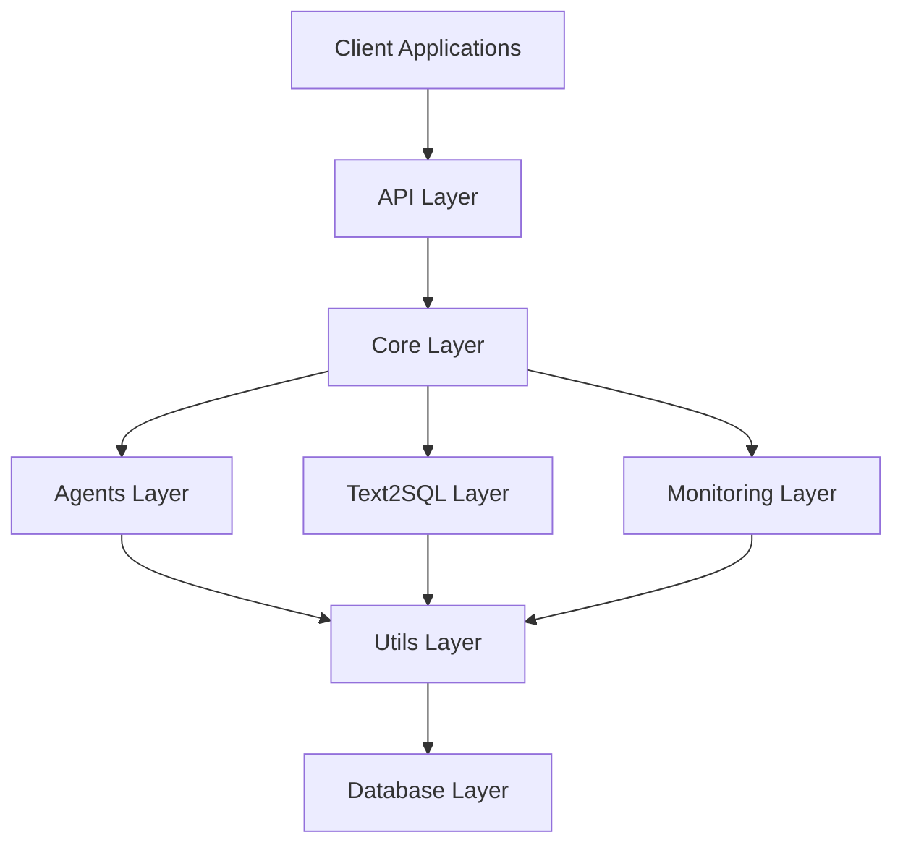
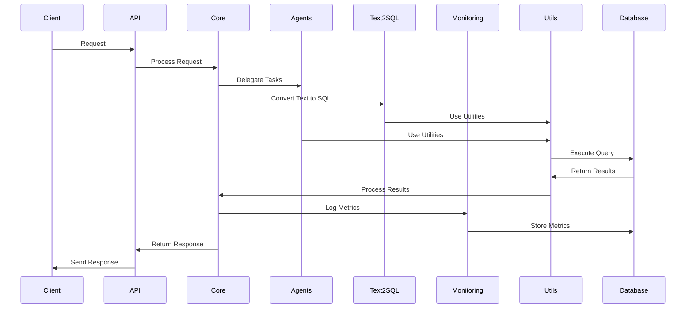
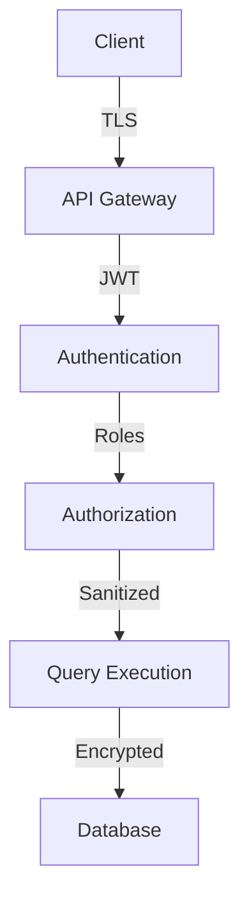
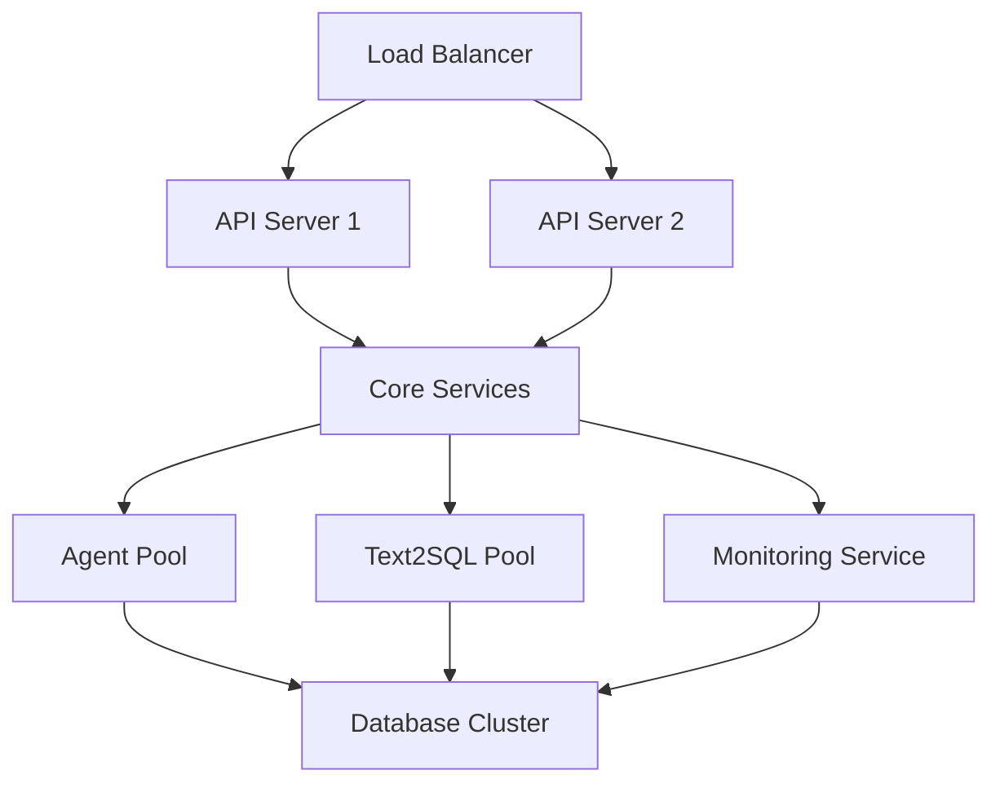

# ADPA Architecture Overview

## System Architecture

ADPA follows a modular, layered architecture designed for flexibility, scalability, and maintainability.



### Layers

1. **API Layer**
   - REST API endpoints
   - Authentication & Authorization
   - Request/Response handling
   - Rate limiting
   - API versioning

2. **Core Layer**
   - Business logic
   - Data processing
   - Workflow management
   - Error handling
   - Configuration management

3. **Agents Layer**
   - Intelligent processing agents
   - Task orchestration
   - Agent communication
   - State management
   - Learning capabilities

4. **Text2SQL Layer**
   - Natural language parsing
   - SQL generation
   - Query optimization
   - Schema management
   - Context handling

5. **Monitoring Layer**
   - Performance monitoring
   - Error tracking
   - Resource usage
   - Metrics collection
   - Visualization

6. **Utils Layer**
   - Common utilities
   - Helper functions
   - Data structures
   - Caching
   - Logging

7. **Database Layer**
   - Data persistence
   - Query execution
   - Connection pooling
   - Transaction management
   - Schema management

## Component Interaction



## Key Design Principles

1. **Modularity**
   - Independent components
   - Clear interfaces
   - Pluggable architecture
   - Easy extensions

2. **Scalability**
   - Horizontal scaling
   - Load balancing
   - Caching strategies
   - Async processing

3. **Security**
   - Authentication
   - Authorization
   - Input validation
   - Query sanitization
   - Secure communication

4. **Reliability**
   - Error handling
   - Retry mechanisms
   - Circuit breakers
   - Data validation

5. **Maintainability**
   - Clean code
   - Documentation
   - Testing
   - Monitoring

## Technology Stack

1. **Core Technologies**
   - Python 3.11+
   - FastAPI
   - SQLAlchemy
   - Pydantic
   - asyncio

2. **Databases**
   - PostgreSQL
   - SQLite
   - MySQL
   - Oracle
   - SQL Server

3. **Monitoring**
   - Prometheus
   - Grafana
   - Custom dashboards
   - Logging system

4. **Development Tools**
   - Poetry
   - pytest
   - black
   - isort
   - mypy

## Configuration Management

```yaml
adpa:
  api:
    host: 0.0.0.0
    port: 8000
    workers: 4
    timeout: 30
  
  core:
    max_threads: 10
    queue_size: 1000
    retry_attempts: 3
  
  agents:
    max_agents: 5
    timeout: 60
    memory_limit: 512M
  
  text2sql:
    model: gpt-4
    max_tokens: 1000
    temperature: 0.7
  
  monitoring:
    interval: 5
    retention: 30d
    metrics_port: 9090
  
  database:
    pool_size: 20
    max_overflow: 10
    timeout: 30
```

## Security Architecture



## Performance Considerations

1. **Caching Strategy**
   - Query results
   - Parsed queries
   - Authentication tokens
   - Configuration

2. **Query Optimization**
   - Indexing
   - Query planning
   - Connection pooling
   - Batch processing

3. **Resource Management**
   - Memory limits
   - Thread pools
   - Connection pools
   - Rate limiting

4. **Monitoring**
   - Performance metrics
   - Resource usage
   - Error rates
   - Response times

## Deployment Architecture



## Next Steps

1. [Component Architecture](./components.md)
2. [Data Flow](./data_flow.md)
3. [Security Model](./security.md)
