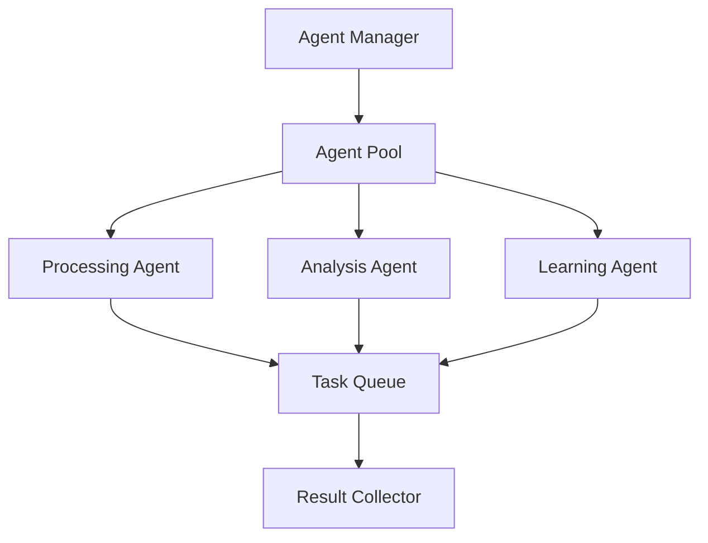
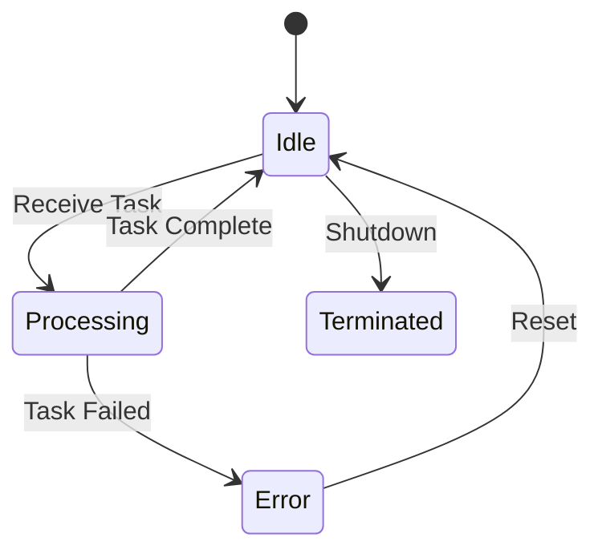

# ADPA Agents

## Overview

The ADPA Agents system is a sophisticated framework for intelligent data processing and task automation. Agents are autonomous entities that can perform specific tasks, learn from their actions, and collaborate with other agents.

## Architecture



## Agent Types

### 1. Processing Agents

Processing agents handle data transformation and manipulation tasks:

```python
from adpa.agents import ProcessingAgent

class DataCleaningAgent(ProcessingAgent):
    """Agent for cleaning and preprocessing data."""
    
    async def process(self, data: pd.DataFrame) -> pd.DataFrame:
        """Clean and preprocess data.
        
        Args:
            data: Input DataFrame
            
        Returns:
            Cleaned DataFrame
        """
        # Remove duplicates
        data = data.drop_duplicates()
        
        # Handle missing values
        data = data.fillna(self.config.fill_values)
        
        # Convert data types
        data = self.convert_datatypes(data)
        
        return data
```

### 2. Analysis Agents

Analysis agents perform data analysis and generate insights:

```python
from adpa.agents import AnalysisAgent

class TrendAnalysisAgent(AnalysisAgent):
    """Agent for analyzing trends in data."""
    
    async def analyze(self, data: pd.DataFrame) -> Dict[str, Any]:
        """Analyze trends in data.
        
        Args:
            data: Input DataFrame
            
        Returns:
            Dictionary of trend analysis results
        """
        return {
            "trends": self.detect_trends(data),
            "patterns": self.find_patterns(data),
            "anomalies": self.detect_anomalies(data)
        }
```

### 3. Learning Agents

Learning agents improve their performance over time:

```python
from adpa.agents import LearningAgent

class QueryOptimizationAgent(LearningAgent):
    """Agent for optimizing SQL queries."""
    
    async def learn(self, query: str, performance: Dict[str, float]) -> None:
        """Learn from query performance.
        
        Args:
            query: SQL query
            performance: Performance metrics
        """
        self.update_model(query, performance)
        self.save_knowledge()
```

## Agent Configuration

Agents can be configured using YAML:

```yaml
agents:
  processing:
    data_cleaning:
      max_memory: 512M
      timeout: 30
      batch_size: 1000
      
  analysis:
    trend_analysis:
      window_size: 100
      min_confidence: 0.95
      max_patterns: 10
      
  learning:
    query_optimization:
      learning_rate: 0.01
      max_iterations: 1000
      model_path: models/query_opt.pkl
```

## Agent Communication

Agents communicate using a message-passing system:

```python
from adpa.agents import Message, AgentProtocol

class DataPipelineAgent(ProcessingAgent):
    async def handle_message(self, message: Message) -> None:
        """Handle incoming message.
        
        Args:
            message: Incoming message
        """
        if message.type == AgentProtocol.REQUEST:
            result = await self.process(message.data)
            await self.send_message(
                target=message.sender,
                type=AgentProtocol.RESPONSE,
                data=result
            )
```

## Agent States

Agents can be in different states:



## Agent Monitoring

Agents provide detailed monitoring:

```python
from adpa.monitoring import AgentMetrics

class MonitoredAgent(ProcessingAgent):
    def __init__(self):
        self.metrics = AgentMetrics()
        
    async def process(self, data: Any) -> Any:
        with self.metrics.measure_time("processing"):
            result = await super().process(data)
            
        self.metrics.record_memory_usage()
        self.metrics.record_task_completion()
        
        return result
```

## Usage Examples

### 1. Creating an Agent Pipeline

```python
from adpa.agents import AgentPipeline

# Create pipeline
pipeline = AgentPipeline([
    DataCleaningAgent(),
    TrendAnalysisAgent(),
    QueryOptimizationAgent()
])

# Process data
results = await pipeline.process(data)
```

### 2. Agent Pool Management

```python
from adpa.agents import AgentPool

# Create agent pool
pool = AgentPool(
    agent_class=DataCleaningAgent,
    min_agents=2,
    max_agents=10
)

# Submit tasks
async with pool.get_agent() as agent:
    result = await agent.process(data)
```

### 3. Distributed Agents

```python
from adpa.agents import DistributedAgentManager

# Create distributed manager
manager = DistributedAgentManager(
    hosts=["host1", "host2", "host3"],
    agent_class=DataCleaningAgent
)

# Deploy agents
await manager.deploy()

# Submit tasks
results = await manager.process_batch(data_batch)
```

## Best Practices

1. **Resource Management**
   - Set appropriate memory limits
   - Use connection pooling
   - Implement timeouts
   - Clean up resources

2. **Error Handling**
   - Implement retry logic
   - Log errors properly
   - Use circuit breakers
   - Handle edge cases

3. **Performance**
   - Batch processing
   - Caching results
   - Async operations
   - Load balancing

4. **Security**
   - Input validation
   - Access control
   - Secure communication
   - Data encryption

## Next Steps

1. [Agent API Reference](../../api_reference/agents.md)
2. [Agent Development Guide](../../development/agents.md)
3. [Agent Examples](../../examples/agents.md)
