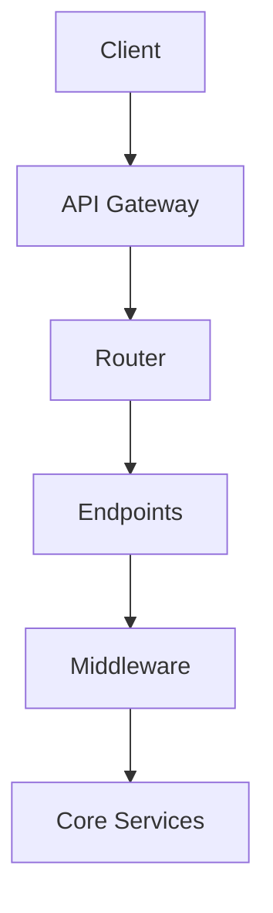

# ADPA API

## Overview

The API component provides a RESTful interface to the ADPA framework, enabling external applications to interact with the system. It's built using FastAPI and follows OpenAPI specifications.

## Architecture



## Components

### 1. API Gateway

Entry point for all requests:

```python
from fastapi import FastAPI
from adpa.api import configure_api
from adpa.api.types import APIConfig

def create_app(config: APIConfig) -> FastAPI:
    """Create FastAPI application.
    
    Args:
        config: API configuration
        
    Returns:
        FastAPI application
    """
    app = FastAPI(
        title="ADPA API",
        description="Advanced Data Processing and Analysis API",
        version="1.4.0"
    )
    
    # Configure API
    configure_api(app, config)
    
    return app
```

### 2. Routers

Route definitions:

```python
from fastapi import APIRouter
from adpa.api.models import QueryRequest, QueryResponse

router = APIRouter(prefix="/v1")

@router.post("/query", response_model=QueryResponse)
async def process_query(request: QueryRequest) -> QueryResponse:
    """Process SQL query request.
    
    Args:
        request: Query request
        
    Returns:
        Query response
    """
    # Convert to SQL
    sql = await text2sql.convert(request.query)
    
    # Execute query
    results = await database.execute(sql)
    
    return QueryResponse(
        sql=sql,
        results=results,
        metadata=get_metadata(results)
    )
```

### 3. Models

Data models:

```python
from pydantic import BaseModel, Field
from typing import List, Dict, Any

class QueryRequest(BaseModel):
    """Query request model."""
    
    query: str = Field(..., description="Natural language query")
    context: Dict[str, Any] = Field(default_factory=dict)
    options: Dict[str, Any] = Field(default_factory=dict)
    
    class Config:
        schema_extra = {
            "example": {
                "query": "Show me sales from last month",
                "context": {"database": "sales"},
                "options": {"limit": 100}
            }
        }

class QueryResponse(BaseModel):
    """Query response model."""
    
    sql: str = Field(..., description="Generated SQL query")
    results: List[Dict[str, Any]] = Field(..., description="Query results")
    metadata: Dict[str, Any] = Field(..., description="Result metadata")
```

### 4. Middleware

Request/response middleware:

```python
from fastapi import Request
from adpa.api.middleware import SecurityMiddleware, LoggingMiddleware

class SecurityMiddleware:
    """Security middleware."""
    
    async def __call__(self, request: Request, call_next):
        """Process request.
        
        Args:
            request: HTTP request
            call_next: Next middleware
        """
        # Verify token
        token = request.headers.get("Authorization")
        await self.verify_token(token)
        
        # Rate limiting
        await self.check_rate_limit(request)
        
        # Process request
        response = await call_next(request)
        
        # Add security headers
        self.add_security_headers(response)
        
        return response

class LoggingMiddleware:
    """Logging middleware."""
    
    async def __call__(self, request: Request, call_next):
        """Process request.
        
        Args:
            request: HTTP request
            call_next: Next middleware
        """
        # Log request
        await self.log_request(request)
        
        # Process request
        response = await call_next(request)
        
        # Log response
        await self.log_response(response)
        
        return response
```

## API Endpoints

### 1. Query Endpoints

```python
@router.post("/query/sql")
async def sql_query(request: SQLRequest) -> SQLResponse:
    """Execute SQL query.
    
    Args:
        request: SQL request
        
    Returns:
        Query results
    """
    return await query_service.execute(request)

@router.post("/query/natural")
async def natural_query(request: NaturalRequest) -> NaturalResponse:
    """Execute natural language query.
    
    Args:
        request: Natural language request
        
    Returns:
        Query results
    """
    return await query_service.process_natural(request)
```

### 2. Analysis Endpoints

```python
@router.post("/analyze/trends")
async def analyze_trends(request: TrendRequest) -> TrendResponse:
    """Analyze trends.
    
    Args:
        request: Trend analysis request
        
    Returns:
        Analysis results
    """
    return await analysis_service.analyze_trends(request)

@router.post("/analyze/patterns")
async def analyze_patterns(request: PatternRequest) -> PatternResponse:
    """Analyze patterns.
    
    Args:
        request: Pattern analysis request
        
    Returns:
        Analysis results
    """
    return await analysis_service.analyze_patterns(request)
```

## Configuration

Configure API using YAML:

```yaml
api:
  server:
    host: 0.0.0.0
    port: 8000
    workers: 4
    
  security:
    jwt_secret: ${JWT_SECRET}
    rate_limit: 100/minute
    
  cors:
    allow_origins: ["*"]
    allow_methods: ["*"]
    allow_headers: ["*"]
    
  logging:
    level: INFO
    format: json
```

## Authentication

```python
from fastapi.security import OAuth2PasswordBearer
from adpa.api.auth import authenticate_user

oauth2_scheme = OAuth2PasswordBearer(tokenUrl="token")

@router.post("/token")
async def login(form_data: OAuth2PasswordRequestForm) -> Token:
    """Authenticate user.
    
    Args:
        form_data: Login credentials
        
    Returns:
        Authentication token
    """
    user = await authenticate_user(form_data.username, form_data.password)
    
    return {
        "access_token": create_token(user),
        "token_type": "bearer"
    }
```

## Error Handling

```python
from fastapi import HTTPException
from adpa.api.errors import APIError

@router.exception_handler(APIError)
async def api_error_handler(request: Request, exc: APIError):
    """Handle API errors.
    
    Args:
        request: HTTP request
        exc: Exception
        
    Returns:
        Error response
    """
    return JSONResponse(
        status_code=exc.status_code,
        content={
            "error": exc.error_code,
            "message": exc.message,
            "details": exc.details
        }
    )
```

## Usage Examples

### 1. Basic Query

```python
import requests

# Execute query
response = requests.post(
    "http://localhost:8000/v1/query/natural",
    json={
        "query": "Show me sales from last month",
        "context": {"database": "sales"}
    }
)

# Get results
results = response.json()
```

### 2. Authenticated Request

```python
import requests

# Get token
token = requests.post(
    "http://localhost:8000/token",
    data={
        "username": "user",
        "password": "pass"
    }
).json()["access_token"]

# Make authenticated request
response = requests.post(
    "http://localhost:8000/v1/analyze/trends",
    headers={"Authorization": f"Bearer {token}"},
    json={"data": data}
)
```

## Best Practices

1. **Security**
   - Use HTTPS
   - Validate input
   - Rate limiting
   - Authentication

2. **Performance**
   - Response caching
   - Request batching
   - Connection pooling
   - Async handlers

3. **Documentation**
   - OpenAPI spec
   - Examples
   - Error codes
   - Status codes

4. **Versioning**
   - API versions
   - Deprecation
   - Migration
   - Backward compatibility

## Next Steps

1. [API Reference](../../api_reference/api.md)
2. [API Examples](../../examples/api.md)
3. [API Development Guide](../../development/api.md)
