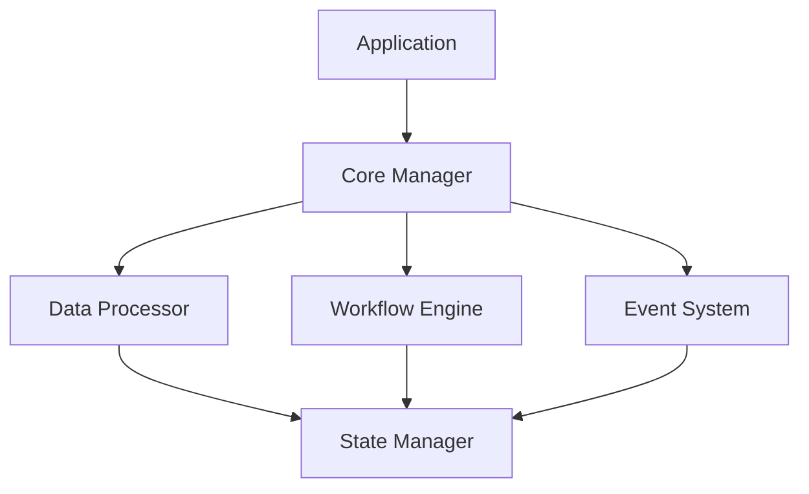

# ADPA Core

## Overview

The Core module is the heart of the ADPA framework, providing essential functionality for data processing, workflow management, and system coordination. It implements the core business logic and orchestrates interactions between other components.

## Architecture



## Components

### 1. Core Manager

The central coordinator:

```python
from adpa.core import CoreManager
from adpa.core.types import CoreConfig, ProcessingResult

class CoreManager:
    """Manage core ADPA functionality."""
    
    def __init__(self, config: CoreConfig):
        """Initialize core manager.
        
        Args:
            config: Core configuration
        """
        self.config = config
        self.processor = DataProcessor()
        self.workflow = WorkflowEngine()
        self.events = EventSystem()
        self.state = StateManager()
    
    async def process_request(self, request: Dict[str, Any]) -> ProcessingResult:
        """Process incoming request.
        
        Args:
            request: Request data
            
        Returns:
            Processing result
        """
        # Validate request
        self.validate_request(request)
        
        # Create workflow
        workflow = await self.workflow.create(request)
        
        # Process data
        result = await self.processor.process(request.data)
        
        # Update state
        await self.state.update(result)
        
        # Emit event
        await self.events.emit("processing_complete", result)
        
        return result
```

### 2. Data Processor

Handles data processing:

```python
from adpa.core import DataProcessor
from adpa.core.types import ProcessingConfig, DataResult

class DataProcessor:
    """Process data using configured strategies."""
    
    async def process(self, data: Any, config: ProcessingConfig) -> DataResult:
        """Process data.
        
        Args:
            data: Input data
            config: Processing configuration
            
        Returns:
            Processing result
        """
        # Select strategy
        strategy = self.get_strategy(config.strategy)
        
        # Preprocess data
        prepared_data = await self.prepare_data(data)
        
        # Apply strategy
        result = await strategy.apply(prepared_data)
        
        # Postprocess result
        return await self.postprocess_result(result)
```

### 3. Workflow Engine

Manages processing workflows:

```python
from adpa.core import WorkflowEngine
from adpa.core.types import Workflow, WorkflowStep

class WorkflowEngine:
    """Manage processing workflows."""
    
    async def create_workflow(self, config: Dict[str, Any]) -> Workflow:
        """Create new workflow.
        
        Args:
            config: Workflow configuration
            
        Returns:
            Created workflow
        """
        # Create steps
        steps = [
            WorkflowStep(
                name=step["name"],
                action=step["action"],
                dependencies=step["dependencies"]
            )
            for step in config["steps"]
        ]
        
        # Create workflow
        workflow = Workflow(steps=steps)
        
        # Initialize state
        await self.initialize_workflow(workflow)
        
        return workflow
    
    async def execute_workflow(self, workflow: Workflow) -> Dict[str, Any]:
        """Execute workflow.
        
        Args:
            workflow: Workflow to execute
            
        Returns:
            Workflow results
        """
        results = {}
        
        # Execute steps in order
        for step in workflow.ordered_steps:
            result = await self.execute_step(step)
            results[step.name] = result
        
        return results
```

### 4. Event System

Handles system events:

```python
from adpa.core import EventSystem
from adpa.core.types import Event, EventHandler

class EventSystem:
    """Manage system events."""
    
    async def emit(self, event_type: str, data: Any) -> None:
        """Emit event.
        
        Args:
            event_type: Type of event
            data: Event data
        """
        event = Event(type=event_type, data=data)
        
        # Get handlers
        handlers = self.get_handlers(event_type)
        
        # Execute handlers
        await asyncio.gather(*[
            handler.handle(event)
            for handler in handlers
        ])
    
    def register_handler(self, event_type: str, handler: EventHandler) -> None:
        """Register event handler.
        
        Args:
            event_type: Type of event
            handler: Event handler
        """
        self.handlers[event_type].append(handler)
```

### 5. State Manager

Manages system state:

```python
from adpa.core import StateManager
from adpa.core.types import State, StateUpdate

class StateManager:
    """Manage system state."""
    
    async def get_state(self) -> State:
        """Get current state.
        
        Returns:
            Current state
        """
        return await self.state_store.get()
    
    async def update_state(self, update: StateUpdate) -> None:
        """Update state.
        
        Args:
            update: State update
        """
        # Validate update
        self.validate_update(update)
        
        # Apply update
        await self.state_store.update(update)
        
        # Notify listeners
        await self.notify_state_change(update)
```

## Configuration

Configure Core using YAML:

```yaml
core:
  processing:
    max_threads: 10
    queue_size: 1000
    batch_size: 100
    
  workflow:
    max_steps: 50
    timeout: 300
    retry_attempts: 3
    
  events:
    max_handlers: 100
    queue_size: 5000
    
  state:
    persistence: true
    sync_interval: 60
```

## Usage Examples

### 1. Basic Processing

```python
from adpa.core import CoreManager, CoreConfig

# Initialize
config = CoreConfig(max_threads=10, queue_size=1000)
core = CoreManager(config)

# Process request
result = await core.process_request({
    "type": "data_analysis",
    "data": dataset,
    "config": processing_config
})
```

### 2. Custom Workflow

```python
from adpa.core import WorkflowEngine, Workflow

# Create workflow
workflow = await engine.create_workflow({
    "steps": [
        {
            "name": "preprocess",
            "action": "clean_data",
            "dependencies": []
        },
        {
            "name": "analyze",
            "action": "perform_analysis",
            "dependencies": ["preprocess"]
        }
    ]
})

# Execute workflow
results = await engine.execute_workflow(workflow)
```

### 3. Event Handling

```python
from adpa.core import EventSystem, EventHandler

# Create handler
class MetricsHandler(EventHandler):
    async def handle(self, event: Event) -> None:
        await self.record_metrics(event.data)

# Register handler
events = EventSystem()
events.register_handler("processing_complete", MetricsHandler())
```

## Best Practices

1. **State Management**
   - Use atomic updates
   - Implement rollback
   - Cache state
   - Handle conflicts

2. **Error Handling**
   - Graceful degradation
   - Retry mechanisms
   - Error reporting
   - State recovery

3. **Performance**
   - Batch processing
   - Async operations
   - Resource pooling
   - Load balancing

4. **Monitoring**
   - Track metrics
   - Log events
   - Monitor resources
   - Alert on issues

## Next Steps

1. [Core API Reference](../../api_reference/core.md)
2. [Core Examples](../../examples/core.md)
3. [Core Development Guide](../../development/core.md)
