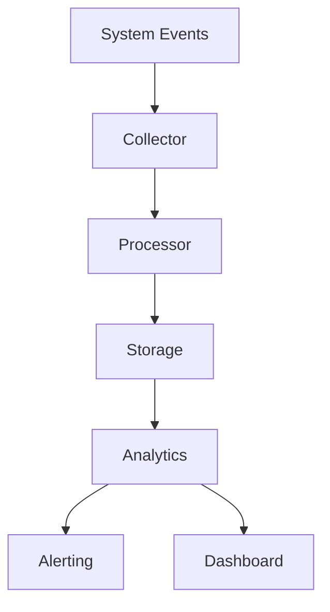

# ADPA Monitoring

## Overview

The Monitoring component provides comprehensive system monitoring, metrics collection, and alerting capabilities for the ADPA framework. It tracks system health, performance metrics, and resource utilization.

## Architecture



## Components

### 1. Metrics Collector

Collects system metrics:

```python
from adpa.monitoring import MetricsCollector
from adpa.monitoring.types import Metric, MetricType

class MetricsCollector:
    """Collect system metrics."""
    
    async def collect(self) -> List[Metric]:
        """Collect current metrics.
        
        Returns:
            List of metrics
        """
        metrics = []
        
        # System metrics
        metrics.extend(await self.collect_system_metrics())
        
        # Application metrics
        metrics.extend(await self.collect_app_metrics())
        
        # Custom metrics
        metrics.extend(await self.collect_custom_metrics())
        
        return metrics
    
    async def collect_system_metrics(self) -> List[Metric]:
        """Collect system metrics.
        
        Returns:
            System metrics
        """
        return [
            Metric(
                name="cpu_usage",
                value=psutil.cpu_percent(),
                type=MetricType.GAUGE
            ),
            Metric(
                name="memory_usage",
                value=psutil.virtual_memory().percent,
                type=MetricType.GAUGE
            )
        ]
```

### 2. Metrics Processor

Processes collected metrics:

```python
from adpa.monitoring import MetricsProcessor
from adpa.monitoring.types import ProcessedMetric

class MetricsProcessor:
    """Process collected metrics."""
    
    async def process(self, metrics: List[Metric]) -> List[ProcessedMetric]:
        """Process metrics.
        
        Args:
            metrics: Raw metrics
            
        Returns:
            Processed metrics
        """
        processed = []
        
        for metric in metrics:
            # Validate metric
            self.validate_metric(metric)
            
            # Transform metric
            transformed = self.transform_metric(metric)
            
            # Aggregate metric
            aggregated = await self.aggregate_metric(transformed)
            
            processed.append(aggregated)
        
        return processed
```

### 3. Metrics Storage

Stores metrics data:

```python
from adpa.monitoring import MetricsStorage
from adpa.monitoring.types import StorageConfig

class MetricsStorage:
    """Store metrics data."""
    
    async def store(self, metrics: List[ProcessedMetric]) -> None:
        """Store metrics.
        
        Args:
            metrics: Processed metrics
        """
        # Prepare batch
        batch = self.prepare_batch(metrics)
        
        # Store metrics
        await self.storage.write_batch(batch)
        
        # Update cache
        await self.update_cache(metrics)
    
    async def query(self, query: MetricsQuery) -> List[ProcessedMetric]:
        """Query stored metrics.
        
        Args:
            query: Metrics query
            
        Returns:
            Query results
        """
        # Check cache
        if cached := await self.check_cache(query):
            return cached
        
        # Execute query
        return await self.storage.execute_query(query)
```

### 4. Analytics Engine

Analyzes metrics data:

```python
from adpa.monitoring import AnalyticsEngine
from adpa.monitoring.types import AnalyticsResult

class AnalyticsEngine:
    """Analyze metrics data."""
    
    async def analyze(self, metrics: List[ProcessedMetric]) -> AnalyticsResult:
        """Analyze metrics.
        
        Args:
            metrics: Processed metrics
            
        Returns:
            Analysis results
        """
        # Calculate statistics
        stats = self.calculate_statistics(metrics)
        
        # Detect anomalies
        anomalies = await self.detect_anomalies(metrics)
        
        # Generate insights
        insights = await self.generate_insights(metrics, anomalies)
        
        return AnalyticsResult(
            statistics=stats,
            anomalies=anomalies,
            insights=insights
        )
```

### 5. Alert Manager

Manages alerts:

```python
from adpa.monitoring import AlertManager
from adpa.monitoring.types import Alert, AlertRule

class AlertManager:
    """Manage system alerts."""
    
    async def check_alerts(self, metrics: List[ProcessedMetric]) -> List[Alert]:
        """Check for alerts.
        
        Args:
            metrics: Processed metrics
            
        Returns:
            Generated alerts
        """
        alerts = []
        
        # Get rules
        rules = await self.get_alert_rules()
        
        # Check rules
        for rule in rules:
            if await self.check_rule(rule, metrics):
                alerts.append(self.create_alert(rule))
        
        # Send alerts
        await self.send_alerts(alerts)
        
        return alerts
```

## Configuration

Configure Monitoring using YAML:

```yaml
monitoring:
  collector:
    interval: 60
    batch_size: 100
    timeout: 30
    
  storage:
    backend: prometheus
    retention: 30d
    compression: true
    
  analytics:
    window_size: 3600
    anomaly_threshold: 2.0
    
  alerts:
    channels:
      - email
      - slack
    throttle: 300
```

## Usage Examples

### 1. Basic Monitoring

```python
from adpa.monitoring import MonitoringSystem

# Initialize
monitoring = MonitoringSystem()

# Start monitoring
await monitoring.start()

# Get metrics
metrics = await monitoring.get_current_metrics()

# Stop monitoring
await monitoring.stop()
```

### 2. Custom Metrics

```python
from adpa.monitoring import MetricsCollector, Metric

# Create collector
collector = MetricsCollector()

# Add custom metric
await collector.add_metric(
    Metric(
        name="query_latency",
        value=response_time,
        type=MetricType.HISTOGRAM
    )
)
```

### 3. Alerts

```python
from adpa.monitoring import AlertManager, AlertRule

# Create rule
rule = AlertRule(
    name="high_cpu",
    metric="cpu_usage",
    condition="value > 90",
    duration="5m"
)

# Add rule
await alert_manager.add_rule(rule)
```

## Best Practices

1. **Data Collection**
   - Regular intervals
   - Batch collection
   - Error handling
   - Data validation

2. **Storage**
   - Data retention
   - Compression
   - Backup strategy
   - Query optimization

3. **Alerting**
   - Clear conditions
   - Proper thresholds
   - Alert routing
   - Alert grouping

4. **Performance**
   - Efficient collection
   - Smart sampling
   - Data aggregation
   - Resource limits

## Next Steps

1. [Monitoring API Reference](../../api_reference/monitoring.md)
2. [Monitoring Examples](../../examples/monitoring.md)
3. [Monitoring Development Guide](../../development/monitoring.md)
