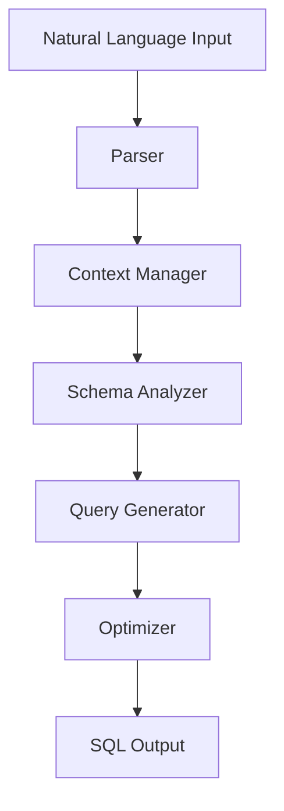

# ADPA Text2SQL

## Overview

The Text2SQL component converts natural language queries into SQL statements. It uses advanced NLP techniques and machine learning models to understand user intent and generate accurate SQL queries.

## Architecture



## Components

### 1. Parser

The parser processes natural language input:

```python
from adpa.text2sql import NLParser, ParsedQuery

class QueryParser:
    """Parse natural language into structured format."""
    
    async def parse(self, text: str) -> ParsedQuery:
        """Parse natural language query.
        
        Args:
            text: Natural language query
            
        Returns:
            Structured query representation
        """
        # Tokenize
        tokens = self.tokenize(text)
        
        # Extract entities
        entities = self.extract_entities(tokens)
        
        # Identify intent
        intent = self.classify_intent(tokens)
        
        return ParsedQuery(
            tokens=tokens,
            entities=entities,
            intent=intent
        )
```

### 2. Context Manager

Manages query context and state:

```python
from adpa.text2sql import QueryContext

class ContextManager:
    """Manage query context and state."""
    
    def __init__(self):
        self.context = QueryContext()
        
    def update_context(self, query: ParsedQuery) -> None:
        """Update context with new query.
        
        Args:
            query: Parsed query
        """
        # Update tables
        self.context.tables.update(query.entities.tables)
        
        # Update columns
        self.context.columns.update(query.entities.columns)
        
        # Update conditions
        self.context.conditions.extend(query.entities.conditions)
```

### 3. Schema Analyzer

Analyzes database schema:

```python
from adpa.text2sql import SchemaAnalyzer

class SchemaAnalyzer:
    """Analyze and validate database schema."""
    
    async def analyze(self, query: ParsedQuery) -> Dict[str, Any]:
        """Analyze schema for query.
        
        Args:
            query: Parsed query
            
        Returns:
            Schema analysis results
        """
        # Get table metadata
        tables = await self.get_table_metadata(query.entities.tables)
        
        # Validate columns
        columns = self.validate_columns(query.entities.columns, tables)
        
        # Check relationships
        relationships = self.find_relationships(tables)
        
        return {
            "tables": tables,
            "columns": columns,
            "relationships": relationships
        }
```

### 4. Query Generator

Generates SQL queries:

```python
from adpa.text2sql import SQLGenerator

class QueryGenerator:
    """Generate SQL from parsed query."""
    
    def generate(self, query: ParsedQuery, schema: Dict[str, Any]) -> str:
        """Generate SQL query.
        
        Args:
            query: Parsed query
            schema: Schema information
            
        Returns:
            SQL query string
        """
        # Generate SELECT clause
        select_clause = self.generate_select(query.entities.columns)
        
        # Generate FROM clause
        from_clause = self.generate_from(schema.tables, schema.relationships)
        
        # Generate WHERE clause
        where_clause = self.generate_where(query.entities.conditions)
        
        return f"{select_clause}\n{from_clause}\n{where_clause}"
```

### 5. Optimizer

Optimizes generated queries:

```python
from adpa.text2sql import QueryOptimizer

class QueryOptimizer:
    """Optimize SQL queries."""
    
    def optimize(self, query: str) -> str:
        """Optimize SQL query.
        
        Args:
            query: SQL query
            
        Returns:
            Optimized query
        """
        # Parse query
        parsed = self.parse_sql(query)
        
        # Apply optimizations
        optimized = self.apply_optimizations(parsed)
        
        # Generate final query
        return self.generate_sql(optimized)
```

## Configuration

Configure Text2SQL using YAML:

```yaml
text2sql:
  parser:
    model: gpt-4
    max_tokens: 1000
    temperature: 0.7
    
  context:
    max_history: 10
    timeout: 30
    
  schema:
    cache_ttl: 3600
    max_tables: 100
    
  generator:
    dialect: postgresql
    pretty_print: true
    
  optimizer:
    enabled: true
    max_iterations: 10
```

## Usage Examples

### 1. Basic Usage

```python
from adpa.text2sql import Text2SQL

# Initialize
text2sql = Text2SQL()

# Convert query
sql = await text2sql.convert("Show me all sales from last month")

# Execute query
results = await database.execute(sql)
```

### 2. With Context

```python
from adpa.text2sql import Text2SQL, QueryContext

# Initialize with context
text2sql = Text2SQL()
context = QueryContext(
    database="sales",
    tables=["orders", "customers"],
    previous_query="SELECT * FROM orders"
)

# Convert with context
sql = await text2sql.convert(
    "Show me their total revenue",
    context=context
)
```

### 3. With Schema

```python
from adpa.text2sql import Text2SQL, DatabaseSchema

# Define schema
schema = DatabaseSchema(
    tables=[
        Table("orders", columns=["id", "customer_id", "amount"]),
        Table("customers", columns=["id", "name"])
    ],
    relationships=[
        Relationship("orders.customer_id", "customers.id")
    ]
)

# Convert with schema
sql = await text2sql.convert(
    "Find top customers by order amount",
    schema=schema
)
```

## Error Handling

```python
from adpa.text2sql import Text2SQLError

try:
    sql = await text2sql.convert("Show me the data")
except Text2SQLError.ParseError as e:
    print(f"Could not parse query: {e}")
except Text2SQLError.SchemaError as e:
    print(f"Schema validation failed: {e}")
except Text2SQLError.GenerationError as e:
    print(f"Could not generate SQL: {e}")
```

## Best Practices

1. **Query Understanding**
   - Use clear, specific queries
   - Provide context when needed
   - Keep schema up to date
   - Handle ambiguity

2. **Performance**
   - Cache schema information
   - Batch similar queries
   - Use query templates
   - Optimize common patterns

3. **Security**
   - Validate input
   - Sanitize queries
   - Use parameterization
   - Limit permissions

4. **Maintenance**
   - Log conversions
   - Monitor accuracy
   - Update models
   - Handle edge cases

## Next Steps

1. [Text2SQL API Reference](../../api_reference/text2sql.md)
2. [Query Examples](../../examples/text2sql.md)
3. [Troubleshooting](../../user_guide/text2sql_troubleshooting.md)
