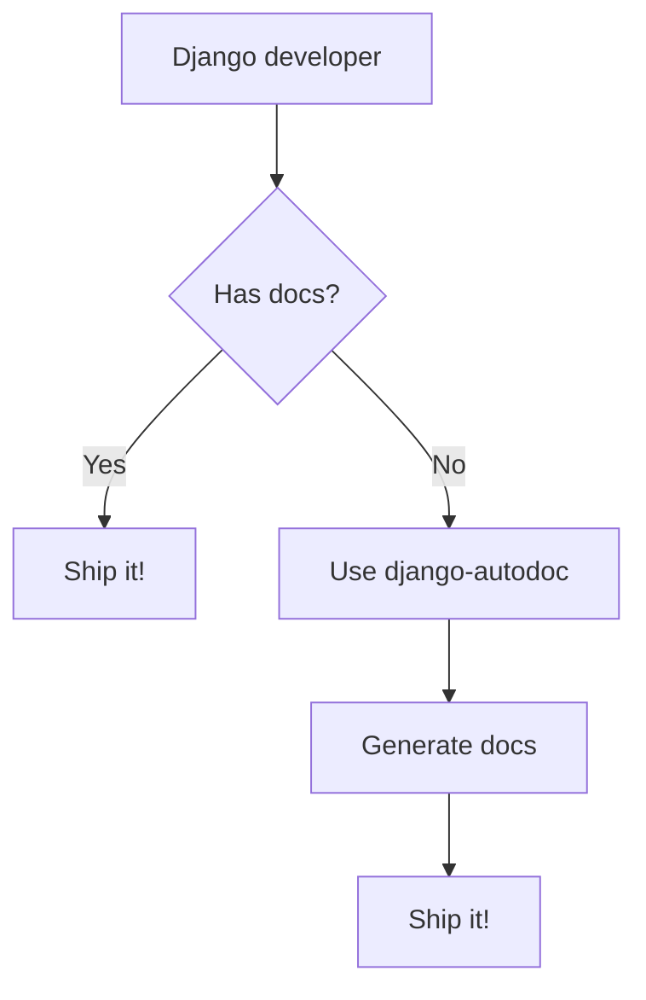

# Autodoc-Django

An auto documentation tool for Django's Apps with [MermaidJS](https://mermaid.live/) in MarkDown files.
<p style="text-align: center;">


</p>

### Installation and Setup
To install Autodoc-Django, run the following command:

```bash
pip install autodoc-django
```
In `settings.py` file, add `autodoc` on `INSTALLED_APPS` constant.
```
INSTALLED_APPS = [
    ...
    "autodoc",
]
```

### Usage
To generate a **Flow Chart** documentation for your Django project, use the following command:

```bash
python3 manage.py autodoc_flow <app_name>
```

To generate a **Sequence Diagram** documentation for your Django project, use the following command:

```bash
python3 manage.py autodoc_sequence <app_name>
```

This will create documentation based on your Django models and views.

### Contributing
Contributions to Autodoc-Django are welcome! Please fork the repository and submit a pull request.

### License
Autodoc-Django is licensed under the MIT License.