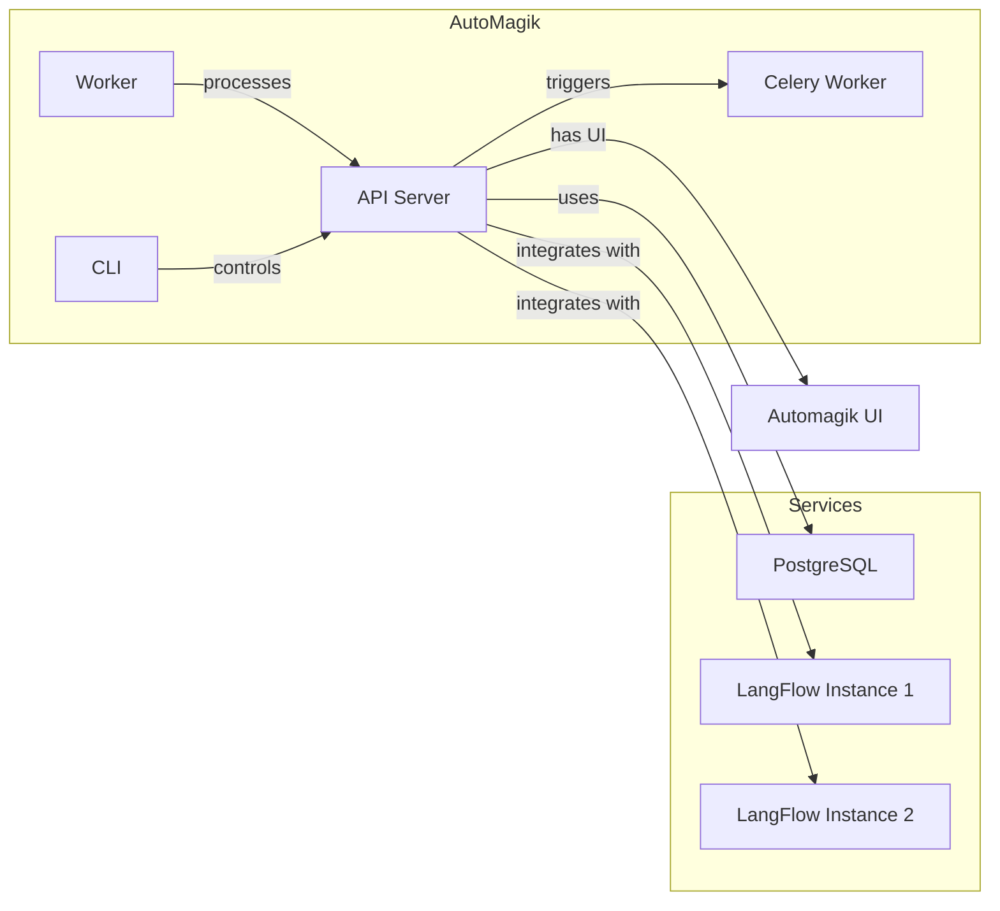

<p align="center">
  
</p>

Because magic shouldn't be complicated.

AutoMagik is an agent-first automation engine that seamlessly integrates with multiple [LangFlow](https://github.com/langflow-ai/langflow) instances. Deploy AI-driven flows, schedule one-time or recurring tasks, and monitor everything with minimal fuss—no coding required.

Create agents using natural language with our dedicated UI available at [AutoMagik UI](https://github.com/namastexlabs/automagik-ui).

---

## Installation

AutoMagik provides two setup options: local production and development environment.

### Prerequisites

- Linux-based system (Ubuntu/Debian recommended)
- Docker and Docker Compose (will be installed automatically on Ubuntu/Debian if not present)

### Local Production Setup

For a production-ready local environment:
```bash
./scripts/setup_local.sh
```

### Development Setup

For development with postgres and redis docker containers:
```bash
./scripts/setup_dev.sh
```

Both setup scripts will:
- Create necessary environment files
- Install Docker if needed (on Ubuntu/Debian)
- Set up all required services
- Install the CLI tool (optional)
- Guide you through the entire process

Once complete, you'll have:
- AutoMagik API running at <http://localhost:8888>
- PostgreSQL database at `localhost:15432`
- Worker service running and ready to process tasks
- CLI tool installed (if chosen)

### Verify Installation

The setup script automatically verifies all services. You can also check manually:

```bash

# Access API documentation
open http://localhost:8888/api/v1/docs  # Interactive Swagger UI
open http://localhost:8888/api/v1/redoc # ReDoc documentation

# List flows (if CLI is installed)
source .venv/bin/activate
automagik flow list
```

### What's Included

- **API Server**: Handles all HTTP requests and core logic
- **Worker**: Processes tasks and schedules
- **Database**: PostgreSQL with all required tables automatically created
- **LangFlow** (optional): Visual flow editor for creating AI workflows
- **CLI Tool** (optional): Command-line interface for managing flows and tasks

### Development Setup

For development, use the development setup script instead:

```bash
./scripts/setup_dev.sh
```

This will:
- Set up a development environment with additional tools
- Configure git hooks for code quality
- Install development dependencies
- Use development-specific configurations

### Project Structure



- **API**: Core service handling requests and business logic
- **Worker**: Processes tasks and schedules
- **CLI**: Command-line tool for managing flows and tasks
- **PostgreSQL**: Stores flows, tasks, schedules, and other data
- **LangFlow**: Optional service for creating and editing flows

### API Endpoints

For complete API documentation, visit:
- Swagger UI: <http://automagikurl:8888/api/v1/docs>


### Next Steps

1. If you installed LangFlow, visit <http://localhost:17860> to create your first flow
2. Use the API at <http://localhost:8888/api/v1/docs> to manage your flows and tasks
3. Try out the CLI commands with `automagik --help`
4. Monitor task execution through logs and API endpoints

## Roadmap

AutoMagik's future development focuses on:

- TBA
