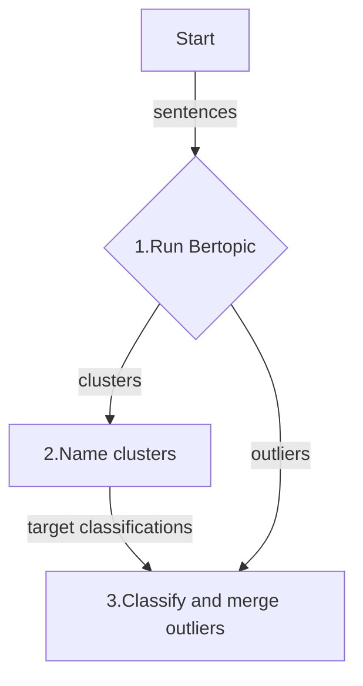

# BERTopic Easy

Polishing [BERTopic](https://maartengr.github.io/BERTopic/index.html) output using OpenAI's `o3-mini`.

## Motivations

-   **OpenAI's `o3-mini`** names clusters well.
-   **OpenAI's `o3-mini`** reduces outliers better than [BERTopic](https://maartengr.github.io/BERTopic/index.html)'s default method.

## Example usage

```python

import os

from dotenv import load_dotenv
from rich import print

from bertopic_easy import bertopic_easy

load_dotenv()
openai_api_key = os.environ["OPENAI_API_KEY"]

texts = [
    "16/8 fasting",
    "16:8 fasting",
    "24-hour fasting",
    "24-hour one meal a day (OMAD) eating pattern",
    "2:1 ketogenic diet, low-glycemic-index diet",
    "30-day nutrition plan",
    "36-hour fast",
    "4-day fast",
    "40 hour fast, low carb meals",
    "4:3 fasting",
    "5-day fasting-mimicking diet (FMD) program",
    "7 day fast",
    "84-hour fast",
    "90/10 diet",
    "Adjusting macro and micro nutrient intake",
    "Adjusting target macros",
    "Macro and micro nutrient intake",
    "AllerPro formula",
    "Alternate Day Fasting (ADF), One Meal A Day (OMAD)",
    "American cheese",
    "Atkin's diet",
    "Atkins diet",
    "Avoid seed oils",
    "Avoiding seed oils",
    "Limiting seed oils",
    "Limited seed oils and processed foods",
    "Avoiding seed oils and processed foods",
]

clusters = bertopic_easy(
    texts=texts,
    openai_api_key=openai_api_key,
    reasoning_effort="low",  # low, medium, high ... slow, slower, slowest
    subject="personal diet intervention outcomes",
)
print(clusters)


```

## Example output


## What's happening under the hood? The three steps...

This is a opinionated hybrid approach to topic modeling using a combination of
embeddings and LLM completions. The embeddings are for clustering and the LLM
completions are for naming and outlier classification.



### Step 1 - Cluster sentences

Bertopic library clusters using embeddings from a `text-embedding-3-large` LLM model.

### Step 2 - Name clusters

Names are generated by a `o3-mini` LLM model for the resulting clusters from **Step 1**.

### Step 3 - Re-group outliers (not implemented yet)

Outlier sentences, those that did not fit into any of the Bertopic clusters
from **Step 1**, are classified by the `o3-mini` LLM using the resulting
cluster names from **Step 2**.

### Install

#### Pre-requisites

-   `python = ">=3.11,<3.13"`

```shell
pip install bertopic-easy
```

## Some BERTopic FAQs

[Why does it take so long to import BERTopic?](https://maartengr.github.io/BERTopic/faq.html#how-can-i-use-bertopic-with-chinese-documents)

## Pointers for contributing developer

Run a smoke test

```shell

poetry run pytest tests/test_main.py::test_bertopic_easy
```

-   make a tiny PR so I can see how I can help you get started
