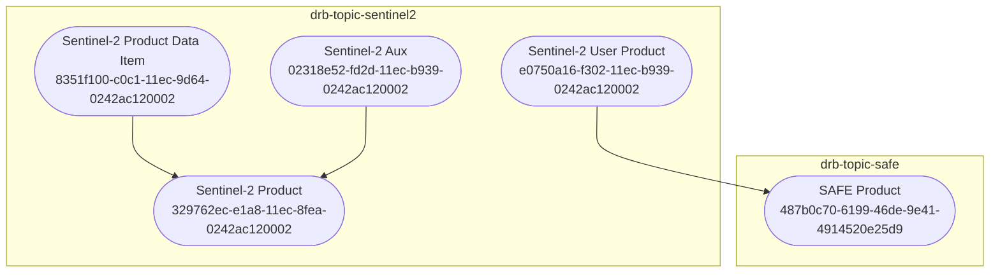
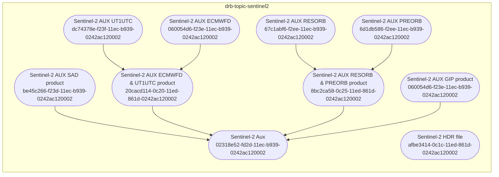
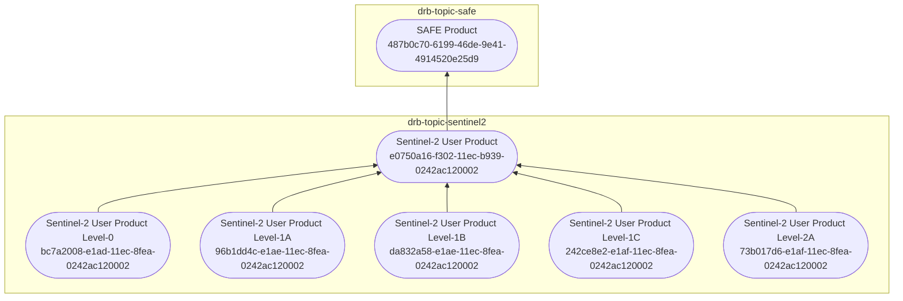
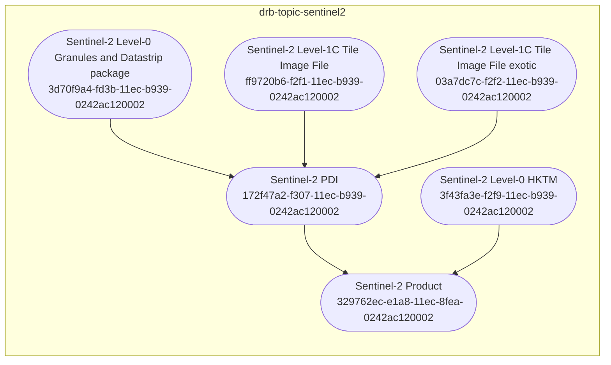
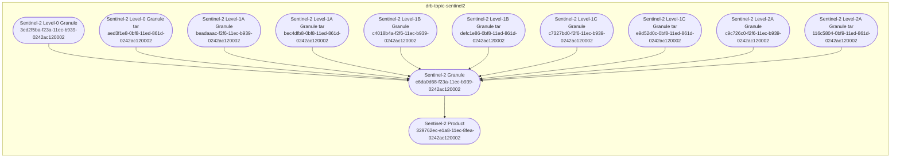
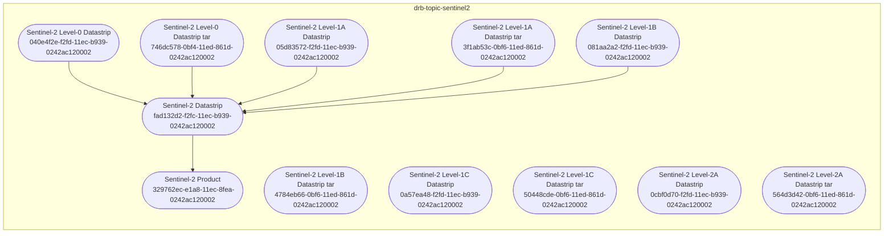

# drb-topic-sentinel2
The `drb-topic-sentinel2` is a DRB plugin declaring topics about
[Sentinel-2](https://sentinels.copernicus.eu/web/sentinel/missions/sentinel-2)
EO satellite.

## Installation
```bash
pip install drb-topic-sentinel2
```

## Sentinel-2 Topics
This section references topics defined in the `drb-topic-sentinel2` DRB plugin.



### Sentinel-2 Aux products Topics



### Sentinel-2 User products Topics




### Sentinel-2 PDI products Topics



### Sentinel-2 Granule products Topics



### Sentinel-2 DataStrip products Topics

