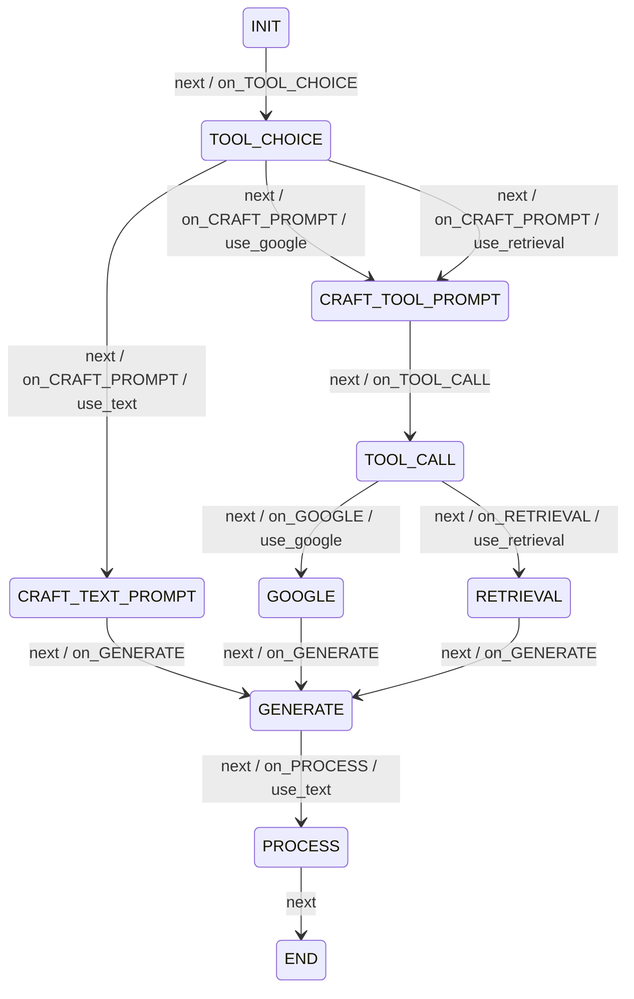

```mermaid

                stateDiagram-v2
                INIT --> TOOL_CHOICE: next / on_TOOL_CHOICE

                TOOL_CHOICE --> CRAFT_TEXT_PROMPT: next / on_CRAFT_PROMPT / use_text
                    CRAFT_TEXT_PROMPT --> GENERATE: next / on_GENERATE
                    GENERATE --> PROCESS: next / on_PROCESS / use_text
                    PROCESS --> END : next

                TOOL_CHOICE --> CRAFT_TOOL_PROMPT: next / on_CRAFT_PROMPT / use_google
                    TOOL_CALL --> GOOGLE: next / on_GOOGLE / use_google
                    GOOGLE --> GENERATE: next / on_GENERATE

                TOOL_CHOICE --> CRAFT_TOOL_PROMPT: next / on_CRAFT_PROMPT / use_retrieval
                    TOOL_CALL --> RETRIEVAL: next / on_RETRIEVAL / use_retrieval
                    RETRIEVAL --> GENERATE: next / on_GENERATE

                CRAFT_TOOL_PROMPT --> TOOL_CALL: next / on_TOOL_CALL
            
```