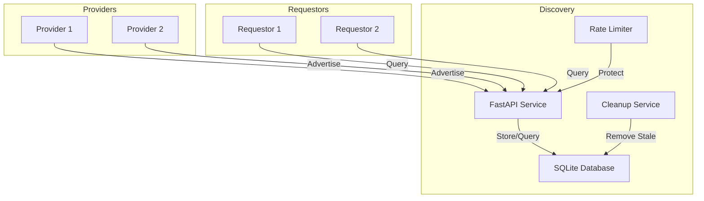
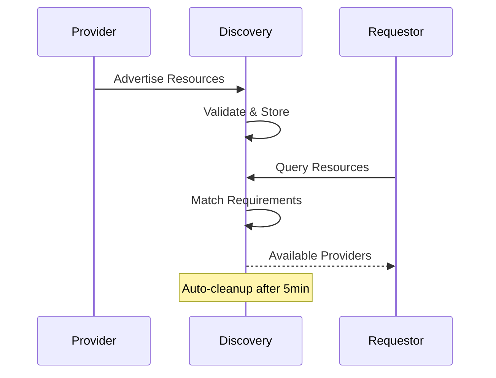

# VM on Golem Discovery Server

The Discovery Server acts as the central hub of the Golem Network, enabling requestors to find providers with matching resources. It manages provider advertisements, handles resource matching, and ensures system reliability.

## System Architecture



## How It Works

### Advertisement Flow



The discovery service manages provider advertisements through:
1. Resource validation and storage
2. Automatic cleanup of stale entries
3. Efficient matching of requestor requirements
4. Rate limiting and security measures

## Installation

```bash
# Clone the repository
git clone https://github.com/golem/vm-on-golem.git
cd vm-on-golem/discovery-server

# Install dependencies
poetry install
```

## Configuration

The server can be configured through environment variables:

```bash
# Server Settings
DISCOVERY_HOST="0.0.0.0"
DISCOVERY_PORT=7465
DISCOVERY_DEBUG=false

# Rate Limiting
DISCOVERY_RATE_LIMIT_PER_MINUTE=100

# Database
DISCOVERY_DB_URL="sqlite:///discovery.db"

# Cleanup
DISCOVERY_CLEANUP_INTERVAL_SECONDS=60
```

## API Reference

### Provider Endpoints

#### Post Advertisement
```bash
POST /api/v1/advertisements
```

Request:
```json
{
    "ip_address": "192.168.1.100",
    "country": "SE",
    "resources": {
        "cpu": 4,
        "memory": 8,
        "storage": 40
    }
}
```

Required Headers:
- `X-Provider-ID`: Unique provider identifier
- `X-Provider-Signature`: Authentication signature

Response:
```json
{
    "provider_id": "provider-1",
    "ip_address": "192.168.1.100",
    "country": "SE",
    "resources": {
        "cpu": 4,
        "memory": 8,
        "storage": 40
    },
    "created_at": "2025-02-20T15:00:00Z",
    "updated_at": "2025-02-20T15:00:00Z"
}
```

### Requestor Endpoints

#### Find Providers
```bash
GET /api/v1/advertisements?cpu=2&memory=4&storage=20&country=SE
```

Response:
```json
[
    {
        "provider_id": "provider-1",
        "ip_address": "192.168.1.100",
        "country": "SE",
        "resources": {
            "cpu": 4,
            "memory": 8,
            "storage": 40
        },
        "updated_at": "2025-02-20T15:00:00Z"
    }
]
```

## Technical Details

### Resource Management

The system tracks three key resources:
- CPU cores (integer)
- Memory in GB (integer)
- Storage in GB (integer)

Resource validation ensures:
- All values are >= 1
- Required fields are present
- Values are within reasonable limits

### Advertisement Lifecycle

1. **Creation**: Providers post their available resources
2. **Update**: Providers refresh their advertisement every few minutes
3. **Expiration**: Advertisements older than 5 minutes are automatically removed
4. **Deletion**: Providers can manually remove their advertisement

### Security Measures

1. **Rate Limiting**
   - Per-IP rate limiting
   - Configurable requests per minute
   - Protection against abuse

2. **Provider Authentication**
   - Required provider headers
   - Signature verification
   - Advertisement ownership validation

3. **Input Validation**
   - Resource requirement validation
   - IP address format checking
   - Country code validation

### Database Schema

```sql
CREATE TABLE advertisements (
    provider_id TEXT PRIMARY KEY,
    ip_address TEXT NOT NULL,
    country TEXT NOT NULL,
    resources TEXT NOT NULL,
    created_at TIMESTAMP DEFAULT CURRENT_TIMESTAMP,
    updated_at TIMESTAMP DEFAULT CURRENT_TIMESTAMP
)
```

### Error Handling

The API uses standardized error responses:

```json
{
    "code": "ERROR_CODE",
    "message": "Human readable message",
    "timestamp": "2025-02-20T15:00:00Z"
}
```

Common error codes:
- `AUTH_003`: Missing provider credentials
- `ADV_001`: Failed to create advertisement
- `ADV_002`: Invalid resource requirements
- `RATE_001`: Rate limit exceeded

## Running the Server

```bash
# Start the server
poetry run python run.py

# The server will be available at:
# - API: http://localhost:7465/api/v1
# - Health Check: http://localhost:7465/health
# - OpenAPI Docs: http://localhost:7465/api/v1/openapi.json
```

## Contributing

1. Fork the repository
2. Create a feature branch
3. Make your changes
4. Run the tests
5. Submit a pull request
