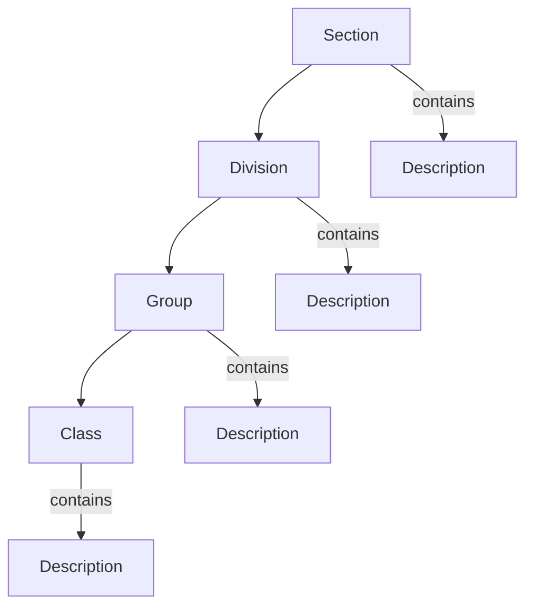

# ISIC4Kit

<p align="center">
  
</p>


A Python SDK Library for working with the International Standard Industrial Classification of All Economic Activities (ISIC), Revision 4.

## Features

- Search and navigate through the ISIC hierarchical structure
- Support for multiple languages (English, Arabic, and more coming soon)
- Pydantic-based
- Easy to use
- Well-documented
- Tested and maintained
- Lightweight and fast

## Data Structure

### ISIC Hierarchy

ISIC follows a hierarchical structure:



Each level contains:
- **Section**: Highest level (A-U), e.g., "A" for Agriculture
- **Division**: Two-digit code (01-99)
- **Group**: Three-digit code (011-999)
- **Class**: Four-digit code (0111-9999)

### Data Format

The ISIC data is organized in a hierarchical structure:

```python
sections = [
    {
        "section": "A",
        "description": "Agriculture, forestry and fishing",
        "divisions": [
            {
                "division": "01",
                "description": "Crop and animal production",
                "groups": [
                    {
                        "group": "011",
                        "description": "Growing of non-perennial crops",
                        "classes": [
                            {
                                "class": "0111",
                                "description": "Growing of cereals"
                            },
                            # ...
                        ]
                    },
                    # ...
                ]
            },
            # ...
        ]
    },
    # ...
]
```

## Demo

The following is a demo of the SDK library in action.

[](https://asciinema.org/a/EIWus3SvaHt71GnjSN0g4KH0u)


## Installation

### Poetry (recommended)
```bash
poetry add isic4kit
```

### pip
```bash
pip install isic4kit
```

## Dependencies

- Python >=3.8, <4.0
- pydantic ^2.10.6
- pytest ^8.3.4

## Usage

### Basic Usage

```python
from isic4kit import ISIC4Classifier

# Initialize classifier (English)
isic_en = ISIC4Classifier(language="en")

# Example 1: Get section (Agriculture)
section = isic_en.get_section("a")
# Access divisions directly
for division in section.divisions:
    print(division.code, division.description)
    # Access groups
    for group in division.groups:
        print(group.code, group.description)
        # Access classes
        for class_ in group.classes:
            print(class_.code, class_.description)
# Or use the tree visualization
section.print_tree()

# Example 2: Get division (Crop and animal production)
division = isic_en.get_division("01")
division.print_tree()

# Example 3: Get group (Growing of non-perennial crops)
group = isic_en.get_group("011")
group.print_tree()

# Example 4: Get class (Growing of cereals)
class_ = isic_en.get_class("0111")
class_.print_tree()
```

### Search Functionality

```python
# Search for activities containing "mining"
results = isic_en.search("mining")
results.print_tree()
```

### Multi-language Support

The classifier supports multiple languages. Here's an example in Arabic:

```python
# Initialize with Arabic language
isic_ar = ISIC4Classifier(language="ar")

# Example 1: Get section (الزراعة)
section_ar = isic_ar.get_section("a")
section_ar.print_tree()

# Example 2: Get division (زراعة المحاصيل والإنتاج الحيواني)
division_ar = isic_ar.get_division("01")
division_ar.print_tree()

# Example 3: Get group (زراعة المحاصيل غير الدائمة)
group_ar = isic_ar.get_group("011")
group_ar.print_tree()

# Example 4: Get class (زراعة الحبوب)
class_ar = isic_ar.get_class("0111")
class_ar.print_tree()

# Example 5: Search in Arabic
search_ar = isic_ar.search("تعدين")
search_ar.print_tree()
```

## Examples

### English Examples

```python
from isic4kit import ISIC4Classifier

# Initialize English classifier
isic_en = ISIC4Classifier(language="en")

# Example 1: Get section (Agriculture)
section_en = isic_en.get_section("a")
section_en.print_tree()
```

Output:
```
└── a: Agriculture, forestry and fishing
    ├── 01: Crop and animal production, hunting and related service activities
    │   ├── 011: Growing of non-perennial crops
    │   │   ├── 0111: Growing of cereals (except rice), leguminous crops and oil seeds
    │   │   ├── 0112: Growing of rice
    │   │   ├── 0113: Growing of vegetables and melons, roots and tubers
    │   │   ├── 0114: Growing of sugar cane
    │   │   ├── 0115: Growing of tobacco
    │   │   ├── 0116: Growing of fibre crops
    │   │   └── 0119: Growing of other non-perennial crops
    │   └── ...
    ├── 02: Forestry and logging
    └── 03: Fishing and aquaculture
```

```python
# Example 2: Get division (Crop and animal production)
division_en = isic_en.get_division("01")
division_en.print_tree()
```

Output:
```
└── 01: Crop and animal production, hunting and related service activities
    ├── 011: Growing of non-perennial crops
    │   ├── 0111: Growing of cereals (except rice), leguminous crops and oil seeds
    │   ├── 0112: Growing of rice
    │   ├── 0113: Growing of vegetables and melons, roots and tubers
    │   ├── 0114: Growing of sugar cane
    │   ├── 0115: Growing of tobacco
    │   ├── 0116: Growing of fibre crops
    │   └── 0119: Growing of other non-perennial crops
    └── ...
```

```python
# Example 3: Get group (Growing of non-perennial crops)
group_en = isic_en.get_group("011")
group_en.print_tree()
```

Output:
```
└── 011: Growing of non-perennial crops
    ├── 0111: Growing of cereals (except rice), leguminous crops and oil seeds
    ├── 0112: Growing of rice
    ├── 0113: Growing of vegetables and melons, roots and tubers
    ├── 0114: Growing of sugar cane
    ├── 0115: Growing of tobacco
    ├── 0116: Growing of fibre crops
    └── 0119: Growing of other non-perennial crops
```

```python
# Example 4: Get class (Growing of cereals)
class_en = isic_en.get_class("0111")
class_en.print_tree()
```

Output:
```
└── 0111: Growing of cereals (except rice), leguminous crops and oil seeds
```

```python
# Example 5: Search in English
search_en = isic_en.search("mining")
search_en.print_tree()
```

Output:
```
├── 05: Mining of coal and lignite
│   ├── 051: Mining of hard coal
│   │   ├── 0510: Mining of hard coal (anthracite)
│   ├── 052: Mining of lignite
│   │   ├── 0520: Mining of lignite
├── 07: Mining of metal ores
│   ├── 071: Mining of iron ores
│   │   ├── 0710: Mining of iron ores
│   ├── 072: Mining of non-ferrous metal ores
│   │   ├── 0721: Mining of uranium and thorium ores
│   │   ├── 0729: Mining of other non-ferrous metal ores
├── 08: Other mining and quarrying
│   ├── 089: Mining and quarrying n.e.c.
│   │   ├── 0891: Mining of chemical and fertilizer minerals
│   │   ├── 0899: Other mining and quarrying n.e.c.
├── 09: Mining support service activities
│   ├── 099: Support activities for other mining and quarrying
│   │   ├── 0990: Support activities for other mining and quarrying
│   │   ├── 2824: Manufacture of machinery for mining, quarrying and construction
```

### Arabic Examples

```python
# Initialize Arabic classifier
isic_ar = ISIC4Classifier(language="ar")

# Example 1: Get section (الزراعة)
section_ar = isic_ar.get_section("a")
section_ar.print_tree()
```

Output:
```
└── a: الزراعة والحراجة وصيد الأسماك
    ├── 01: أنشطة زراعة المحاصيل والإنتاج الحيواني والصيد والخدمات المتصلة
    │   ├── 011: زراعة المحاصيل غير الدائمة
    │   │   ├── 0111: زراعة الحبوب باستثناء الأرز( والمحاصيل البقولية والبذور الزيتية)
    │   │   └── ...
    └── ...
```

```python
# Example 5: Search in Arabic
search_ar = isic_ar.search("تعدين")
search_ar.print_tree()
```

Output:
```
├── 05: تعدين الفحم والليغنيت
│   ├── 051: تعدين الفحم القاسي (الأنفراثيت)
│   │   ├── 0510: تعدين الفحم القاسي (الأنفراثيت)
│   ├── 052: تعدين الليغنيت
│   │   ├── 0520: تعدين الليغنيت
├── 07: تعدين ركازات الفلزات
│   ├── 071: تعدين ركازات الحديد
│   │   ├── 0710: تعدين ركازات الحديد
│   └── ...
└── ...
```

## Supported Languages

- English (en)
- Arabic (ar)
- More languages coming soon...

## Development Setup

```bash
# Clone the repository
git clone https://github.com/anqorithm/isic4kit.git
cd isic4kit

# Install poetry (if not already installed)
curl -sSL https://install.python-poetry.org | python3 -

# Install dependencies
poetry install

# Activate virtual environment
poetry shell
```

## Testing

Run the test suite using pytest:

```bash
# Run all tests
poetry run pytest

```


## Coverage

The test suite includes unit tests for all classes and methods. The coverage report can be generated using the following command:

```bash
poetry run pytest --cov=isic4kit tests/
```


## Contributing

Contributions are welcome! Please feel free to submit a Pull Request.

## Contributors

- [Abdullah Alqahtani](https://github.com/anqorithm)

## References

1. United Nations Statistics Division. (2008). International Standard Industrial Classification of All Economic Activities (ISIC), Revision 4. [English Version](https://unstats.un.org/unsd/classifications/Econ/Download/In%20Text/ISIC_Rev_4_publication_English.pdf)

2. United Nations Statistics Division. (2008). التصنيف الصناعي الدولي الموحد لجميع الأنشطة الاقتصادية، التنقيح 4. [Arabic Version](https://unstats.un.org/unsd/classifications/Econ/Download/In%20Text/ISIC_Rev_4_publication_Arabic.pdf)

3. Ministry of Commerce - Saudi Arabia. (2023). ISIC4 Guide. [Source](https://mc.gov.sa/ar/guides/ISIC4/Pages/default.aspx)

4. Saudi Food and Drug Authority. (2023). Economic Activities Classification. [Source](https://www.sfda.gov.sa/en/economic-activities)

5. General Authority for Statistics - Saudi Arabia. (2023). ISIC4 Classification. [Source](https://www.stats.gov.sa/en/isic4)

## License

[MIT License](LICENSE)