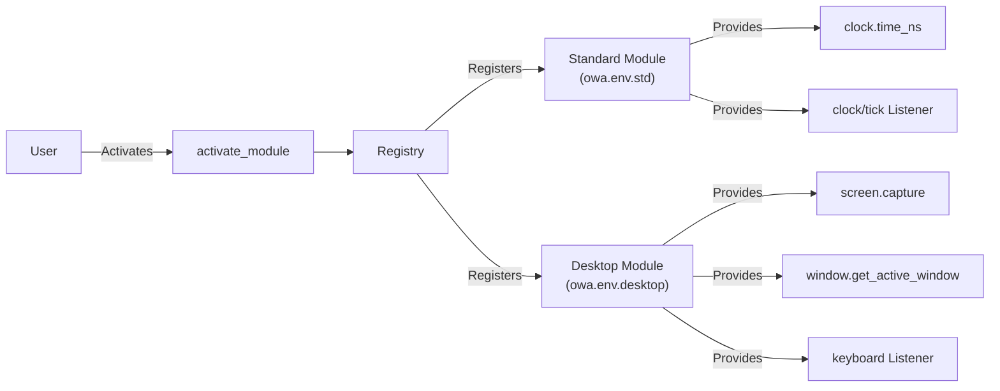

# Open World Agents - Detailed Overview

This document provides a comprehensive explanation of the core functionalities and underlying logic of the Open World Agents codebase. Open World Agents is a modular agent system, where a variety of modules are dynamically registered and utilized at runtime. Below, you will find an in-depth description of the core logic, sample code, and a range of additional example projects.

## 1. Introduction

Open World Agents leverages a registration pattern that allows multiple modules to be dynamically activated during runtime. Each module's functionalities are registered in a global registry using dedicated dictionaries: CALLABLES for synchronous functions and LISTENERS for asynchronous/event-driven listeners.

## 2. Core Architecture and Registry Pattern

- **Registry (CALLABLES & LISTENERS):**
  - **CALLABLES:** Stores module-provided functionalities as key-value pairs (e.g., registered as `clock.time_ns`). What developer must implement is just `__call__` function.
  - **LISTENERS:** Manages classes responsible for event handling by storing them under designated keys (e.g., registered as `clock/tick`). This class takes `callback` as argument in `__init__` and otherwise it's same as `Runnables`.
  - **RUNNABLES:** This is parent class of `Listeners` and it supports `start/stop/join` operations in user side and developer must implement `loop/cleanup` methods.

Modules are activated via the `activate_module` function, during which their functions and listeners are systematically added to the global registry.

## 3. Detailed Explanation of Core Logic

### 3.1. Standard Environment (owa.env.std)

The `projects/core/main.py` file initiates the standard environment. In the following example:

```python
import time
from owa.registry import CALLABLES, LISTENERS, activate_module

# Initial registry state (empty)
print(CALLABLES, LISTENERS)  # {}, {}

# Activate the standard module to register clock functionalities
activate_module("owa.env.std")
print(CALLABLES, LISTENERS)
# Example: 'clock.time_ns' is registered in CALLABLES and 'clock/tick' in LISTENERS

# Testing the clock/tick listener
tick = LISTENERS["clock/tick"]()
tick.configure(callback=lambda: print(CALLABLES["clock.time_ns"]()), interval=1)
tick.activate()

time.sleep(1)  # The listener prints the current time in nanoseconds a few times

tick.deactivate()
tick.shutdown()
```

This code demonstrates how activating the standard module registers clock-related functions and listeners, enabling real-time time display.

### 3.2. Desktop Environment (owa.env.desktop)

After the standard module, the desktop module is activated. This module provides user interface and input-related features. For example:

```python
# Activate the desktop module to enable UI and input capabilities
activate_module("owa.env.desktop")

# Using screen capture and window management features
print(CALLABLES["screen.capture"]().shape)  # Example output: (1080, 1920, 3)
print(CALLABLES["window.get_active_window"])()
print(CALLABLES["window.get_window_by_title"]("open-world-agents"))

# Simulating a mouse click (left button, double click)
mouse_click = CALLABLES["mouse.click"]
mouse_click("left", 2)

# Configuring a keyboard listener

def on_keyboard_event(event_type, key):
    print(f"Keyboard event: {event_type}, {key}")

keyboard_listener = LISTENERS["keyboard"]()
keyboard_listener.configure(on_keyboard_event)
keyboard_listener.activate()

time.sleep(5)
```

This snippet illustrates functionalities such as capturing the screen, managing windows, handling mouse clicks, and responding to keyboard events.

### 3.3. Custom Extensions

The framework also supports custom modules. For instance, a module that integrates with Minecraft can be activated and used as shown below:

```python
# Example of a custom module integration with Minecraft
activate_module("owa_minecraft")
inventory = CALLABLES["minecraft.get_inventory"](player="Steve")
```

This flexibility allows developers to extend system capabilities without altering the core codebase.

## 4. Advanced Features and Extension Points

- **Modularity:** New modules can be seamlessly added, registered, and activated without modifying existing code.
- **Dynamic Activation:** The `activate_module` function allows modules to be enabled at runtime, enhancing system extensibility and flexibility.
- **Event-Driven Design:** Listeners handle asynchronous events, enabling real-time responses to external inputs.

## 5. Architecture Diagram

Below is a diagram illustrating the relationships between core components:



## 6. Overview of Additional Example Projects

Within the `/projects` directory, besides the core module, several example projects are available:

- **data_collection:** Example projects focusing on data collection and processing agents.
- **minecraft_env:** A project that integrates with Minecraft to manipulate and process in-game data.
- **core:** Contains the main logic and core modules, including the functionalities discussed above.

These projects showcase the system's extensibility, modularity, and diverse application scenarios.

## 7. How to Contribute

1. Fork the repository and create a new feature branch.
2. Commit your changes in accordance with the coding guidelines (e.g., adding new modules or enhancing existing ones).
3. Reflect your modifications in both the code and documentation.
4. Submit a pull request for review.
5. Engage in community discussions to incorporate feedback.

## 8. License

This project is released under the MIT License. All contributors are expected to adhere to the project guidelines.

---

## 9. In-Depth Core Logic Analysis

The example in `projects/core/main.py` demonstrates the following flow:

- **Initial State:** At startup, the CALLABLES and LISTENERS registries are empty.
- **Standard Module Activation:** Upon calling `activate_module("owa.env.std")`, clock-related functionalities such as `clock.time_ns` and the `clock/tick` listener are registered.
- **Listener Utilization:** The `clock/tick` listener invokes a callback to print the current time in nanoseconds, illustrating its activation, deactivation, and shutdown processes.
- **Desktop Features:** Subsequent activation of `owa.env.desktop` registers functionalities for screen capture, window management, and input handling.
- **Extensibility:** Custom modules (e.g., `owa_minecraft`) can be integrated effortlessly to extend the system's capabilities.

## 10. Dependencies and Environment

- **Python Version:** The project requires Python 3.11 or higher.
- **Platform-Specific Dependencies:**
  - Windows: `pygetwindow`
  - macOS: `pyobjc-framework-Quartz`, `pyobjc-framework-ApplicationServices`
- **Common Dependencies:**
  - `pynput` for keyboard and mouse events
  - `opencv-python` and `bettercam` for screen capture and image processing
  - `loguru` for logging
  - `pydantic` for data validation and management

The project configuration is defined in the `pyproject.toml` file, and a suitable virtual environment (e.g., specifying the UV_PROJECT_ENVIRONMENT variable) is required.

## 11. Testing and Quality Assurance

A comprehensive suite of tests ensures the stability and reliability of the core functionalities and modules, located in the `projects/core/tests` directory. These tests validate:

- The correct registration and deregistration of module functionalities.
- Proper initialization of modules via `activate_module`.
- Accurate event handling and callback execution for various listeners (e.g., `clock/tick`, `keyboard`).
- Platform-specific behavior for functionalities like screen capture and window management.

Maintaining robust testing practices ensures the system's stability and extensibility. Contributors are encouraged to update tests alongside their changes.

## 12. Conclusion

Open World Agents is designed as a flexible, extensible, and robust framework for developing agent-based solutions with dynamic module loading and real-time event processing. We welcome contributions and discussions from the global open-source community to help enhance and evolve the project.

Happy coding, and let's innovate together!
