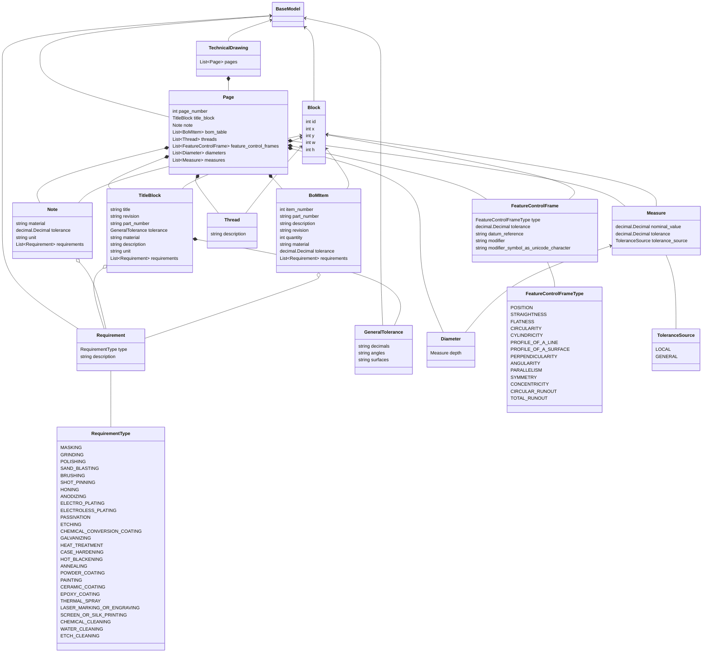

```mermaid
classDiagram
    class BaseModel
    BaseModel <-- TechnicalDrawing
    BaseModel <-- Page
    BaseModel <-- Block
    BaseModel <-- Requirement
    BaseModel <-- GeneralTolerance

    class TechnicalDrawing {
        List~Page~ pages
    }
    TechnicalDrawing *-- Page

    class Page {
        int page_number
        TitleBlock title_block
        Note note    
        List~BoMItem~ bom_table    
        List~Thread~ threads
        List~FeatureControlFrame~ feature_control_frames
        List~Diameter~ diameters
        List~Measure~ measures
    }
    Page *-- TitleBlock
    Page *-- Note
    Page *-- BoMItem
    Page *-- Thread
    Page *-- FeatureControlFrame
    Page *-- Diameter
    Page *-- Measure

    class Block {
        int id
        int x
        int y
        int w
        int h
    }
    Block <-- TitleBlock
    Block <-- Note
    Block <-- BoMItem
    Block <-- Thread
    Block <-- FeatureControlFrame
    Block <-- Measure

    class TitleBlock {
        string title
        string revision
        string part_number
        GeneralTolerance tolerance
        string material
        string description
        string unit
        List~Requirement~ requirements
    }
    TitleBlock *-- GeneralTolerance
    TitleBlock o-- Requirement

    class GeneralTolerance {
        string decimals
        string angles
        string surfaces
    }

    class Note {
        string material
        decimal.Decimal tolerance
        string unit
        List~Requirement~ requirements
    }
    Note o-- Requirement
    
    class BoMItem {
        int item_number
        string part_number
        string description
        string revision
        int quantity
        string material
        decimal.Decimal tolerance
        List~Requirement~ requirements
    }
    BoMItem o-- Requirement

    class Requirement {
        RequirementType type
        string description
    }
    Requirement -- RequirementType

    class RequirementType {
        MASKING
        GRINDING
        POLISHING
        SAND_BLASTING
        BRUSHING
        SHOT_PINNING
        HONING
        ANODIZING
        ELECTRO_PLATING
        ELECTROLESS_PLATING
        PASSIVATION
        ETCHING
        CHEMICAL_CONVERSION_COATING
        GALVANIZING
        HEAT_TREATMENT
        CASE_HARDENING
        HOT_BLACKENING
        ANNEALING
        POWDER_COATING
        PAINTING
        CERAMIC_COATING
        EPOXY_COATING
        THERMAL_SPRAY
        LASER_MARKING_OR_ENGRAVING
        SCREEN_OR_SILK_PRINTING
        CHEMICAL_CLEANING
        WATER_CLEANING
        ETCH_CLEANING
    }

    class Thread {
        string description
    }

    class FeatureControlFrame {
        FeatureControlFrameType type 
        decimal.Decimal tolerance
        string datum_reference
        string modifier
        string modifier_symbol_as_unicode_character
    }
    FeatureControlFrame -- FeatureControlFrameType
    
    class FeatureControlFrameType {
        POSITION
        STRAIGHTNESS	
        FLATNESS
        CIRCULARITY
        CYLINDRICITY
        PROFILE_OF_A_LINE
        PROFILE_OF_A_SURFACE
        PERPENDICULARITY
        ANGULARITY
        PARALLELISM
        SYMMETRY
        CONCENTRICITY
        CIRCULAR_RUNOUT
        TOTAL_RUNOUT
    }
    
    class Measure {
        decimal.Decimal nominal_value
        decimal.Decimal tolerance
        ToleranceSource tolerance_source     
    }
    Measure <-- Diameter
    Measure -- ToleranceSource

    class ToleranceSource {
        LOCAL
        GENERAL
    }
    
    class Diameter {
        Measure depth
    }

```