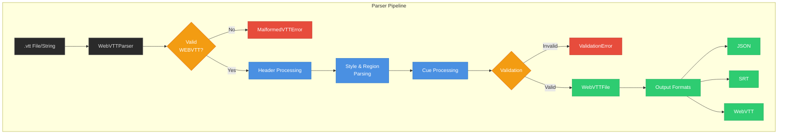

# WebVTT Python Parser

A Python implementation of the [WebVTT (Web Video Text Tracks)](https://www.w3.org/TR/webvtt1/) format parser with strict validation and error handling.

## Features

- Full compliance with W3C WebVTT specification
- Strict and lenient parsing modes
- Comprehensive model validation:
  - Timestamp format validation
  - Cue timing consistency checks
  - Region setting validation
  - Position/size value range checks
- Detailed error reporting with context
- Support for:
  - Header metadata
  - Regions with scroll settings
  - Cue positioning and alignment
  - Multi-line cues
  - Voice spans and basic styling

## Installation

```bash
pip install webvtt-python
```

Or using `uv` for faster installation:
```bash
uv add webvtt-python
```

## Quick Start

```python
from webvtt_python import WebVTTParser, WebVTT

# Parse from string
parser = WebVTTParser(strict=True)
content = """WEBVTT

00:00:01.000 --> 00:00:02.000
Hello world!

00:00:02.500 --> 00:00:05.000 position:50%
Multi-line
subtitle
"""

webvtt: WebVTT = parser.parse(content)
for cue in webvtt.cues:
    print(f"{cue.start_time:.1f}-{cue.end_time:.1f}s: {cue.text}")
```

## Advanced Usage

### Region Handling
```python
content = """WEBVTT
REGION
id:test
width:40%
lines:3
regionanchor:0%,100%
viewportanchor:10%,90%
"""

webvtt = parser.parse(content)
region = webvtt.regions[0]
print(f"Region {region.id}: {region.width}% width, {region.lines} lines")
```

### Error Handling
```python
try:
    parser.parse("00:00:01.000 --> 00:00:00.500\nInvalid timing")
except ValueError as e:
    print(f"Validation error: {e}")
```

### Cue Settings
```python
cue = webvtt.cues[0]
print(f"Position: {cue.position}%")
print(f"Alignment: {cue.text_alignment.value}")
print(f"Writing direction: {cue.writing_direction}")
```

## Architecture

The WebVTT parser implements the [W3C WebVTT specification](https://www.w3.org/TR/webvtt1/).



### Key Components

1. **Input Processing**
   - File or string input
   - WEBVTT validation
   - BOM handling

2. **Content Parsing**
   - Header and metadata
   - Styles and regions
   - Cue timing and text

3. **Output Options**
   - JSON serialization
   - SRT conversion
   - WebVTT formatting

## API Reference

### WebVTTParser
```python
WebVTTParser(strict: bool = True)
```
- `strict`: Raise errors for invalid content (default True)

Methods:
- `parse(content: str | TextIO) -> WebVTT`

### WebVTT Model
```python
class WebVTT:
    cues: List[WebVTTCue]
    regions: List[WebVTTRegion]
    styles: List[str]
    header_comments: List[str]
```

### WebVTTCue
```python
class WebVTTCue:
    start_time: float
    end_time: float
    text: str
    identifier: Optional[str]
    region: Optional[str]
    position: Optional[float]
    size: float
    text_alignment: TextAlignment
    # ... other properties
```

### WebVTTRegion
```python
class WebVTTRegion:
    id: str
    width: float
    lines: int
    region_anchor: Tuple[float, float]
    viewport_anchor: Tuple[float, float]
    scroll: str
```

## Development

```bash
git clone https://github.com/yourusername/webvtt-python.git
cd webvtt-python
uv venv
source .venv/bin/activate
uv sync --system
```

### Running Tests
```bash
uv run pytest tests/ -v
```

## License
MIT License

## Contributing
Contributions welcome! Please open an issue first to discuss proposed changes.

## Acknowledgments
- W3C WebVTT specification team
- Python datetime module for timestamp parsing inspiration
